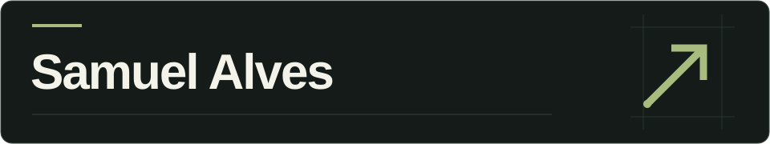

  

Founder & CEO at Sagitta Digital · Head of Technology at FNCD Capital

I lead teams and build digital products, connecting business goals with product decisions, software architecture and hands-on development.

I like understanding the problem, questioning the solution and staying involved until it works in practice. My work goes from the first product conversations to launch and ongoing improvement.

What I work on

Web & mobile products: applications that connect customer experiences with business operations.

Business platforms: SaaS products, internal tools and operational workflows.

APIs & integrations: connecting applications, payments and business systems.

Technical leadership: architecture, priorities, code review and release quality.

Technologies in my projects

  
  
  
  
  
  

Area

Supporting tools & platforms

Web & data

JavaScript SQL Vite

Quality & delivery

Git GitHub Vitest Vercel

Learning & interests

Studying: Digital Product Leadership at Tera.

Exploring: AI-assisted development, practical automation and product architecture.

Education: MBA in Digital Business — USP/Esalq.

Beyond the screen

Faith, family, books and rock music. Away from the keyboard, I make time for gym training, jiu-jitsu and mobility.

Let's connect

LinkedIn · Sagitta Digital · Email

Some of my professional work lives in private organization repositories. This profile includes public projects, earlier work and experiments.
